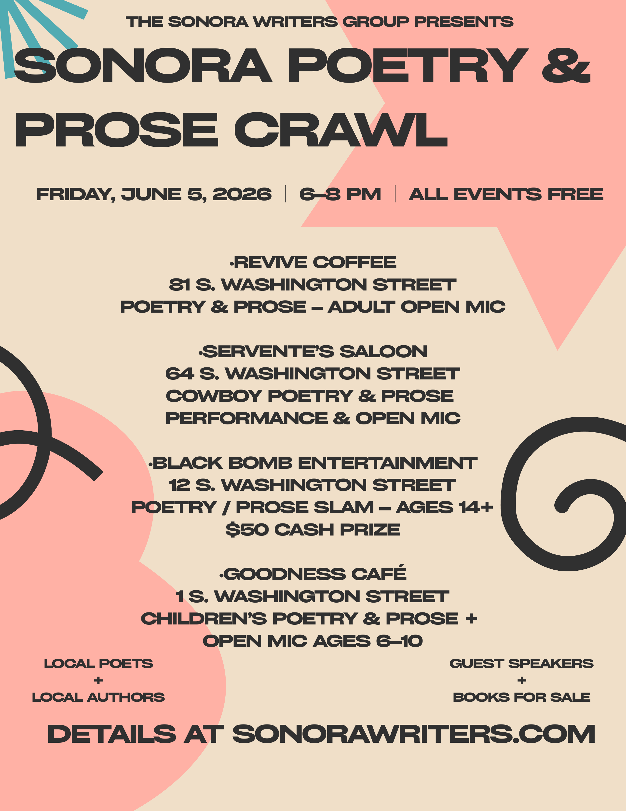

**Poetry & Prose Crawl in Downtown Sonora**

[Download the flyer here!](sonora-poetry-and-prose-crawl-poster.pdf)

The Sonora Writers Group invites the community to an evening of creativity, storytelling, and connection at the **Poetry & Prose Crawl** on **Friday, June 5, from 6:00 PM to 8:00 PM** in downtown Sonora.

This engaging, multi-venue literary event will unfold across four unique locations, featuring live performances, open mic opportunities, and engaging poetry and prose for all ages. **Attendees are invited to bring their own original work to share during open mic sessions throughout the evening.**

Stroll from venue to venue and experience a rich variety of styles—from cowboy poetry and spoken word to youth competitions and children’s readings. Whether you're a writer ready to share your work, a poetry enthusiast eager to listen, or simply curious, there’s something here for everyone.

---

**Event Locations & Activities**

**Revive Coffee (81 S. Washington Street)**

**Poetry & Prose (Adults)**  
Enjoy an evening of spoken and written word during an open mic session (6-minute maximum per reader).  
**MC:** Blanche Abrams

---

**Servente’s Saloon (64 S. Washington Street )**

**Cowboy Poetry & Prose Performance & Open Mic**  
Featuring: Kent Reeves, Wendy Brown-Barry, Connie Corcoran, and Cyndie Zikmond  
**MC:** Amy Lee

---

**Black Bomb Entertainment (12 S. Washington Street)**

**Poetry Slam (Ages 14–20)**  
Watch young poets and storytellers compete in a high-energy slam for a **$50 cash prize**.  
**Judges:** Nick Hugues and Joslyne Wrede

**Slam Rules:**

* **Original Work:** All entries must be original and not previously published or entered in other competitions.   
* **Time Limits:**   
  * Poetry: up to 5 minutes   
  * Prose/Flash Fiction: up to 7 minutes   
* **Submission Requirement:** All pieces must be printed and reviewed for language and subject matter prior to performance.   
* **Entry Limits:**   
  * Up to 3 poems per participant   
  * Up to 2 prose/flash fiction pieces per participant 

---

**Goodness Café (1 S. Washington Street)**

**Children’s Poetry & Prose (Ages 6–10)**  
A fun and welcoming space for young writers and readers, featuring a children’s open mic.  
Featuring: Cynthia Restivo, Glenn Ditman, and Kristin Fulton  
**MC:** Glenn Ditman

---

Bring your friends, explore downtown, and celebrate the power of words with the Sonora writing community. Whether you perform, listen, or simply soak in the atmosphere, the Sonora Poetry & Prose Crawl promises an inspiring evening for all.

**Read Local. Write Local. Support Local.**

