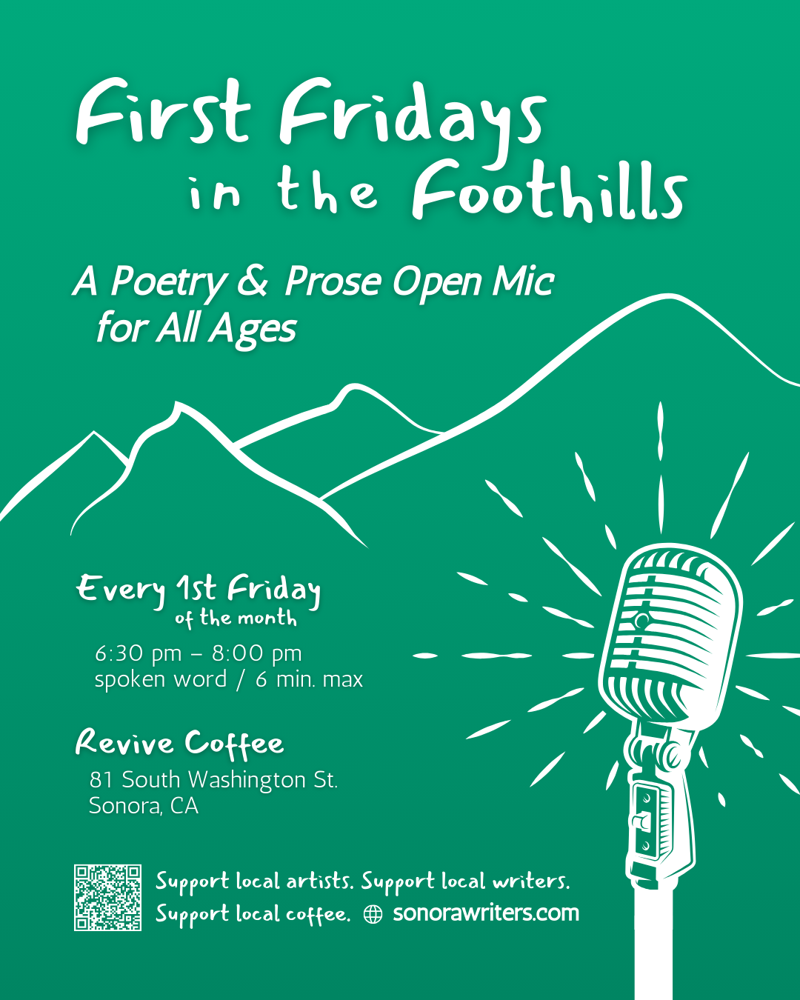

First Fridays in the foothills… a poetry & prose open mic for all ages

6:30-8:00pm, starting March 7, 2025
Revive Coffee, So. Washington St., Sonora

join us in celebrating the written word! bring your own poems or stories (or favorites written by other writers) to share in a welcoming and supportive community space. from spirited to serious, effervescent to emotional, we look forward to hearing what you share. all words and ages are welcome. 

- arrive early to sign up (for either a poetry or prose reading)
- written/spoken word only (no music)
- feeling words and language are always welcome.however, to make these events more inclusive for all ages and expressions, please do not use any expletives or hateful/violent language (if you do, you will be asked to leave).
- limited to 6 minutes per person to allow as many folx as possible an opportunity to be heard.

we look forward to seeing you there!
